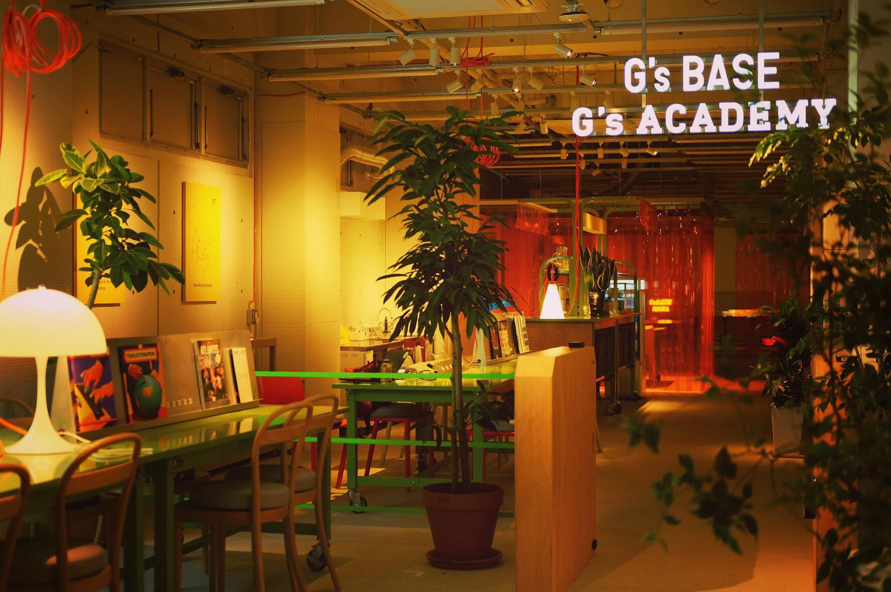

# 初めての HTML & CSS

## 目標

- HTML と CSS の役割を知る．

- HTML と CSS で開発する流れに慣れる．

- 成果物をつくり，成功体験を得る．

↓↓↓ 成果物 ↓↓↓


## 目次

- HTML と CSS の役割

- 開発の流れ．

- HTML を書いて動かす．

- CSS を書いて動かす．

※ HTML と CSS の中身の話はしません．

## HTML と CSS の役割

- HTML は「何を表示するか」．

- CSS は「どのように表示するか」．

| 言語 | 役割                       | ファイル |
| :--- | :------------------------- | :------- |
| HTML | Web ページの構造を記述する | `.html`  |
| CSS  | Web ページの装飾を記述する | `.css`   |

## 開発の流れ

1. エディタでフォルダを開く．

2. HTML ファイルと CSS ファイルを作成する（今回は作成済み）．

3. HTML ファイルに HTML を書く．CSS ファイルに CSS を書く．

4. 書いたファイルをブラウザで動作させ，確認する．

5. 3 と 4 を繰り返す．

## HTML を書いて動かす

### 準備

本ページの「<> Code」ボタン → 「Download ZIP」で，今回使用するコードをダウンロードしましょう．

ダウンロードしたファイルを解凍し，作成されたフォルダをエディタで開く．

### HTML の構造をつくる

HTML はコンテンツを記述する．ブラウザが読んで表示するものなので，ルールに従って記述する必要がある．**HTML は「タグ」を使うのがルール．**

全体の構造は以下の通り（毎回同じ）．この全体構造を最初に作成するが，`!` → `Tab` で簡単に作成できる．`index.html` を開いて，以下の内容を記述する．

```html
<!DOCTYPE html>
<html lang="en">
  <head>
    <meta charset="UTF-8" />
    <meta name="viewport" content="width=device-width, initial-scale=1.0" />
    <title>Document</title>
  </head>
  <body></body>
</html>
```

全体が作成できたら `<html lang="en">` 部分の `en` を `ja` に変更する．日本語で記述する場合，これを行わないとフォントがうまく表示されないことがある．

> 💡 **Point**
>
> `!` → `Tab` などの機能はエディタの機能である．emmet という機能で，HTML と CSS の記述を簡単に行うことができる．
>
> これ以外にもタグの作成を簡単に行う機能などもあるので，使いこなせると開発が捗る．

### 画面に表示する

`<body>` タグの中に，表示したいコンテンツを記述する．画面に表示する内容は全て `<body>` タグの中に記述する．

今回はタイトルを表す `<h1>` タグと，文章を表す `<p>` タグを使う．画像の表示は `` タグを使い，`src` 属性に画像のパスを指定する．

```html
<!-- index.html -->

<body>
  <h1>G's ACADEMY</h1>
  <p>G'g ACADEMY は夜になると一部の照明が消えてナイトモードになります．</p>
  <p>昼間とはまた異なる雰囲気でコードに集中できる環境です．</p>
  
</body>
```

### ブラウザで動作確認する

エディタ右下の「Go Live」をクリックすると，自動的にブラウザが立ち上がり，HTML で書いた内容が表示される．

↓ のように表示されれば OK．動かない場合は保存忘れを疑う．


> 💡 **Point**
>
> 一度「Go Live」をクリックすると，エディタの右下に `Port: 5500` と表示される．
>
> この状態になっていれば，HTML と CSS を書き換えると，自動的にブラウザの画面が更新されるため，次以降の確認では直接画面を確認するだけで OK．

## CSS を書いて動かす

### CSS のファイルを読み込む

CSS は HTML に読み込ませる必要がある．HTML には `<head>` タグがあるので，そこに読み込む．

```html
<!-- index.html -->

<head>
  <!-- 省略 -->
  <link rel="stylesheet" href="css/main.css" />
</head>
```

### CSS を書く

CSS は HTML のタグに対して，どのように表示するかを記述する．今回は以下のように記述する．CSS は CSS ファイルに書くため，`css/main.css` を開いて記述する．

```css
/* css/main.css */

body {
  background-color: #333;
}

h1,
p {
  text-align: center;
  color: #fff;
}

img {
  display: block;
  width: 500px;
  margin: 0 auto;
  box-shadow: 0 0 10px rgba(0, 0, 0, 0.5);
}
```

### ブラウザで動作確認する

エディタの右下に `Port: 5500` と表示されていれば，ブラウザの画面が自動的に更新されているはず．


今日はこれで完成！

> 💡 **Point**
>
> 表示が変わらない場合は，以下の点を確認する．
>
> - HTML ファイルに CSS を読み込む記述があるか．
>
> - HTML ファイルと CSS ファイルが保存されているか．

## まとめ

- HTML は「何を表示するか」，CSS は「どのように表示するか」．

- 開発は「コードを書く → ブラウザで確認する」の繰り返し．

- HTML と CSS が連携した状態になれば，後はコードを書くのみ！

開発の流れに慣れておけば，コードの中身に集中できます．今回の流れを何回か繰り返して「考えずに操作できる」状態を目指しましょう！
